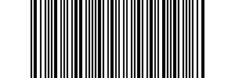
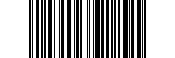
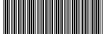

WitLab's Gists
================
## 1. [BarbeQR](BarbeQR/BarbeQR.html) - BarbeQR is a set of sample Java codes that write image files of barcodes, and QR codes.

### Java Source Files

* ZXingEncoder class encodes the barcode content string and writes a PNG file. [ZXingEncoder.java](https://gist.github.com/witlab/6e62441333410e3fd65d)

* ZXingDecoder class reads a PNG file with a barcode / QR code, and decodes it to a string value. [ZxingDecoder.java](https://gist.github.com/witlab/4aedde8fa566229bbeee)

* TestZXingEncoderDecoder is a JUnit class to test ZXingEncode and ZXingDecoder classes. [TestZXingEncoderDecoder.java](https://gist.github.com/witlab/5ec411ee74c4409d0b7e)

### Dependencies
* ZXing http://code.google.com/p/zxing/

-------------

